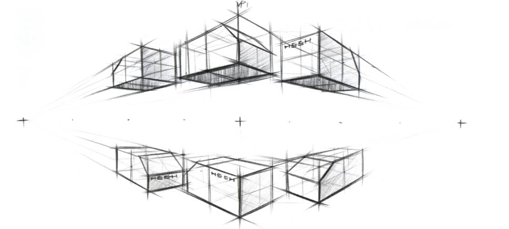
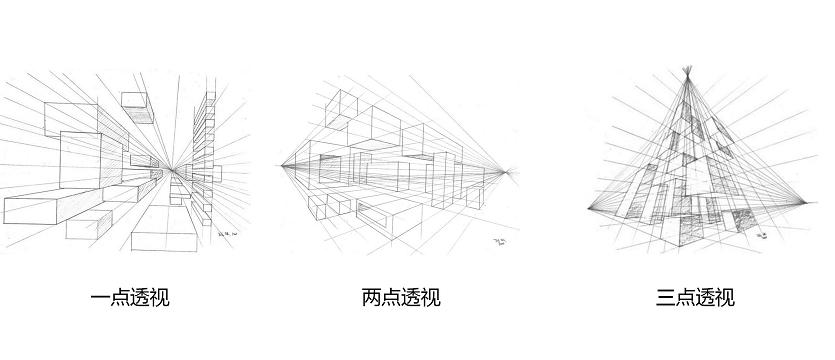
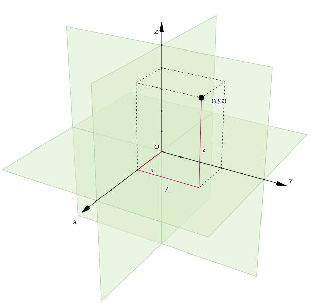

# 详解如何用 CSS3 完成 3D transform变换


***Tips：阅读提示！！！***
1. 首先，本文针对的是3D transform变换的学习，所以你需要对 [2D transform变换](https://www.w3school.com.cn/css/css3_2dtransforms.asp) 有一定的了解  
2. 其次，需要说明的是，代码是一种需要自己不断实践的学科，建议各位在开始学习本篇文档的时候，先创建一个`html页面`来边读边练，
	相信这样，一定会给你留下一个非常直观且深刻的印象！
	

### 本文练习一些公共代码
鉴于本文贴了不少代码来演示，所有这里提前放一个所有演示的公共代码片段
```
	// 公共DOM元素，后续均为此写样式表
	// 舞台容器
	<div class="stage">
		// 变换元素
		<div class="box"></div>
		<div class="box"></div>
		<div class="box"></div>
		<div class="box"></div>
		<div class="box"></div>
	</div>
	
	// 样式兼容的各个浏览器属性头，有需要的在各自代码中添加  
	// 下列测试代码使用Chorme运行  
	-webkit-  /* Safari 和 Chrome */
	-ms- 	  /* IE */
	-moz- 	  /* Firefox */
	-o- 	 /* Opera */
```


### 实现3D变换的基础 -- 透视(perspective)
当我们步入`CSS3`动画殿堂之时，我们一般都会从一些简单动的东西开始学习，比如元素的位移，旋转，放大缩小之类的`2D transform变换`，
那么如何在一个`2D`的屏幕上实现`3D`的变换呢，这里我们就先需要有一个概念，就是 ***透视***  

从一个最简单的 ***透视*** 说起，我们小时候的数学课上，数学老师一定会给我们画一个立体正方形，能够在`2D`平面上看出`3D`效果就是 ***透视*** 的作用

用一张直观的图片来说明一下  
  

透视的类型有以下几种  
  

#### 那么在CSS3中如何用代码实现透视呢？  
1. 主要是通过`perspective`属性来实现定义透视距离  
2. `perspective`属性定义`3D`元素距视图的距离，以像素计，该属性允许您改变`3D`元素查看`3D`元素的视图  
3. 透视距离可以这么理解，如果你的显示器宽度是`1920px`的分辨率，那么`2000px`的透视距离就近似于，从显示器平面开始，一个显示器宽度的距离  
4. 默认值是`0px`，可以理解为初始位置  
5. 注意！！！当为元素定义 perspective 属性时，其子元素会获得透视效果，而不是元素本身  
6. 它有两种写法，单个元素时候看似效果相同，但是多元素在同一个舞台上呈现时，就会出现问题了
	+ 第一种，是写在舞台元素上，定义`perspective`属性  
	+ 第二种，是配合`transform`属性一起，例如：`transform: perspective(600px) rotateY(45deg)`  
	+ 参考下方示例，您可以在自己的demo中测试效果区别，你会发现第二种所有元素都是同一角度的旋转，
		这是因为第一种透视点是`.stage`中央，第二种透视点是每一个`.box`中央  
```
	// 第一种写法
	.stage {
		width: 100%;
		height: 100%;
		perspective: 1000px;
		-webkit-perspective: 500px;
	}
	.stage .box {
		width: 100px;
		height: 100px;
		margin: 100px 100px;
		background-color: #55ffff;
		display: inline-block;
	    transform: rotateY(65deg);
		-webkit-transform: rotateY(65deg);
	}
	
	// 第二种写法
	.stage {
		width: 100%;
		height: 100%;
	}
	.stage .box {
		width: 100px;
		height: 100px;
		margin: 100px 100px;
		background-color: #55ffff;
		display: inline-block;
	    transform: perspective(1000px) rotateY(65deg);
		-webkit-transform: perspective(1000px) rotateY(65deg);
	}
```

#### 透视基点位置属性（perspective-origin）
1. 既然我我们有透视距离的概念，那么这个透视基点的意思就是，我们所看的舞台或者元素的中心  
2. `perspective`(透视)属性必须和`perspective-origin`(透视基点)属性一同使用  
3. `perspective-origin: x-axis y-axis`，xy可以分别是这些值：
	+ left  
	+ right  
	+ center  
	+ length，像素  
	+ %，百分比  
4. 举个不恰当的例子，透视基点类似看足球比赛中那个球的位置，因为所有人眼都会盯着场上的足球，你和球的距离理解为透视距离就好，当然这并不恰当，不要在意  
5. 该属性必须与`perspective`属性一同使用，而且只影响`3D`转换元素，它可以定义在元素中，并且同`perspective`属性一样，定义在哪里影响哪里
6. 默认值是`50% 50%`，表示 xy 中心位置  
7. 下面我们利用一个示例来看看，你依旧可以通过修改demo中的参数，看到效果的变化  
```
	// 50% 50% 正好是变换元素的中心点，也是默认值  
	.stage {
		width: 100%;
		height: 100%;
		perspective: 604px;
		-webkit-perspective: 604px;
		// 使用百分比
		perspective-origin: 50% 50%;
		-webkit-perspective-origin: 50% 50%;
		// 使用像素
		// perspective-origin: 200px 100px;
		// -webkit-perspective-origin: 200px 100px;
		// 使用位置
		// perspective-origin: left center;
		// -webkit-perspective-origin: left center;
		// 也可以混用
		// perspective-origin: 200px 10%;
		// -webkit-perspective-origin: 200px 10%;
	}
	.stage .box {
		width: 100px;
		height: 100px;
		margin: 100px 100px;
		background-color: #55ffff;
		display: inline-block;
	    transform: rotateY(65deg);
		-webkit-transform: rotateY(65deg);
	}
```

#### 透视盲区
在我们进行3D变换的时候还会遇到透视盲区的问题，比如一个正方形，旋转45°之后，正好和你的视线完全平行，那么这个面你就看不到，这就是视觉盲区  
你可以利用下方代码在自己的demo中查看一下效果  
```
	// 我的电脑分辨率是`1920*1080`，透视距离是`604px`
	// 如果你看不到效果，可以尝试修改旋转角度或透视距离，找一下出现盲区的角度  
	.stage {
		width: 100%;
		height: 100%;
		perspective: 604px;
		-webkit-perspective: 604px
	}
	
	.stage .box {
		width: 100px;
		height: 100px;
		margin: 100px 100px;
		background-color: #55ffff;
		display: inline-block;
	    transform: rotateY(65deg);
		-webkit-transform: rotateY(65deg);
	}
```


### 实现静态的3D变换 -- 转换(transform)
相信在2D变换的学习中对于`transform`属性一定不陌生了，它不仅可以进行`2D`变换，也可以进行`3D`变换，只不过需要借助上一个透视的属性，我们才可以在屏幕中看到变换的效果  

先来说明一个三维坐标系的概念，通俗点来说，`z轴`对应垂直方向，`x轴`对应前后方向，`y轴`对应左右方向  
后续我们所说的绕轴变化，你就可以参考这个图例，想象一下发生的变换  


接下来我们来看看`transform`支持的变换类型，如果对此您有疑问，可以参考[w3school的可测试教程](https://www.w3school.com.cn/cssref/pr_transform.asp)： 
1. 2D类型
	> 转换（位移）  `translate(x,y)` / `translateX(x)` / `translateY(y)`  
	> 缩放 `scale(x,y)` / `scaleX(x)` / `scaleY(y)`  
	> 旋转 `rotate(angle)` / `rotateX(angle)` / `rotateY(angle)`  
	> 倾斜 `skew(x-angle,y-angle)` / `skewX(angle)` / `skewY(angle)`  
	> `matrix()`，把所有 2D 变换方法组合为一个，可接受六个参数，`matrix(scaleX(),skewY(),skewX(),scaleY(),translateX(),translateY())`  
2. 3D类型
	> 转换（位移） `translate3d(x,y,z)` / `translateZ(z)`，主要是垂直距离的位移  
	> 缩放 `scale3d(x,y,z)` / `scaleZ(z)`，同样是垂直距离的缩放  
	> 旋转 `rotate3d(x,y,z,angle)` / `rotateX(angle)` / `rotateY(angle)` / `rotateZ(angle)`  
	> `rotateX`/`rotateY`/`rotateZ`三种函数分别意思是绕着`XYZ`轴做旋转运动，`angle`参数为单位为`deg`的角度  
	> `rotate3d`函数定义一个变换，它将元素围绕固定轴移动而不使其变形，运动量由指定的角度定义，
	> 如果为正，运动将为顺时针，如果为负，则为逆时针，想要了解更多可以参考 [这篇文档中的动态示例](https://developer.mozilla.org/zh-CN/docs/Web/CSS/transform-function/rotate3d()) 理解  

`2D`变换请参考 [本文Tips中的链接](https://www.w3school.com.cn/css/css3_2dtransforms.asp) 或百度教程，下面我们来详细看下实现静态`3D`变换的代码  
```
	.stage {
		width: 100%;
		height: 100%;
		perspective: 500px;
		-webkit-perspective: 500px;
		perspective-origin: 50% 50%;
		-webkit-perspective-origin: 50% 50%;
	}
	
	.stage .box {
		width: 100px;
		height: 100px;
		margin: 100px 100px;
		background-color: #55ffff;
		display: inline-block;
		// 这里表示绕Y轴做旋转65度的变换
		transform: rotate3d(0, 1, 0, 65deg);
		-webkit-transform: rotate3d(0, 1, 0, 65deg);
	}
```

#### 转换基点位置属性（transform-origin）  
1. `transform-origin`属性允许您改变被转换元素的位置，`2D`转换元素能够改变元素xy轴，`3D`转换元素还能改变其z轴  
2. `transform-origin: x-axis y-axis z-axis`，这定义了视图被置于xyz轴的何处，z值只能是`length`，xy可以分别是这些值：
	+ left  
	+ right  
	+ center  
	+ length，像素  
	+ %，百分比  
3. `transform-origin`属性必须和`transform`属性一同使用  
4. 默认值是`50% 50% 0`，表示转换基点位于 xy 中心以及 z轴 0 的位置
5. 下面我们利用一个示例来看看，你依旧可以通过修改demo中的参数，看到效果的变化
```
	.stage {
		width: 100%;
		height: 100%;
		perspective: 500px;
		-webkit-perspective: 500px;
		perspective-origin: 50% 50%;
		-webkit-perspective-origin: 50% 50%;
	}
	
	.stage .box {
		width: 100px;
		height: 100px;
		margin: 100px 100px;
		background-color: #55ffff;
		display: inline-block;
		transform: rotate3d(0, 1, 0, 65deg);
		-webkit-transform: rotate3d(0, 1, 0, 65deg);
		// 表示旋转元素的基准点在 x 100px  y 100px  z -900px 位置
		// 值类型自由使用，不做过多说明，参考上方透视基点属性
		transform-origin: 100px 100px -900px;
		-webkit-transform-origin: 100px 100px -900px;
	}
```

#### 转换如何呈现属性（transform-style）  
1. `transform-style`属性规定如何在`3D`空间中呈现被嵌套的元素  
2. `transform-style: flat | preserve-3d`，`flat`表示子元素将不保留其`3D`位置，`preserve-3d`表示子元素保留其`3D`位置  
3. 默认值是`flat`，不保留3D位置  
4. 下面用一个不同于上面几个示例的示例来展示整个属性的效果，你可以在demo中修改几个属性来查看效果  
```
	<div class="stage">
		<div class="box">
			<div class="box-out">
				<div class="box-in"></div>
			</div>
		</div>
	</div>
	
	.stage {
		width: 100%;
		height: 100%;
		perspective: 1600px;
		-webkit-perspective: 1600px;
	}
	
	.stage .box {
		width: 400px;
		height: 400px;
		margin: 100px 100px;
		background-color: #55ffff;
		transform: rotate3d(0, 1, 0, 65deg);
		-webkit-transform: rotate3d(0, 1, 0, 65deg);
		// 这里会展示3D效果
		transform-style: preserve-3d;
		-webkit-transform-style: preserve-3d;
		// 不展示3D效果
		// transform-style: flat;
		// -webkit-transform-style: flat;
	}
	
	.stage .box .box-out {
		width: 90%;
		height: 90%;
		background-color: #ffff00;
		transform: rotate3d(0.5, 1, 0, 85deg);
		-webkit-transform: rotate3d(0.5, 1, 0, 85deg);
	}
	
	.stage .box .box-out .box-in {
		width: 150%;
		height: 150%;
		background-color: #aaff7f;
		transform: rotate3d(0.1, 1, 0.5, 85deg);
		-webkit-transform: rotate3d(0.1, 1, 0.5, 85deg);
	}
```

#### 背面是否可见属性（backface-visibility）
1. `backface-visibility`属性定义当元素不面向屏幕时是否可见  
2. `backface-visibility: visible | hidden`，`visible`表示背面是可见的，`hidden`表示背面不可见  
3. 该属性主要用于不想展示被旋转元素的背面时使用，通常用于一些翻转动效，比如炉石的抽卡，就属于背面可见    
4. 下面我们可以通过翻拍效果示例来理解一下这个属性的作用  
```
	<div class="stage">
		<div class="box">
			<div class="box-prev"></div>
			<div class="box-next"></div>
		</div>
	</div>
	
	.stage {
		width: 100%;
		height: 100%;
		perspective: 1600px;
		-webkit-perspective: 1600px;
	}
	
	.box {
		width: 400px;
		height: 400px;
		margin: 100px 100px;
		position: relative;
		transition: 0.5s all;
		transform-style: preserve-3d;
		-webkit-transform-style: preserve-3d;
	}
	
	.box-prev, 
	.box-next {
		width: 100%;
		height: 100%;
		position: absolute;
		transition: 0.5s all;
		backface-visibility: hidden;
	}
	
	.box-prev {
		background-color: #ffff00;
		z-index: 1;
	}
	
	.box-next {
		background-color: #aaff7f;
		transform: rotateY(180deg);
		z-index: 0;
	}
	
	.box:hover{
		transform: rotateY(180deg);
	}
```


### 做一些简单的循环动效  
学习了上述代码之后，我们可以做一些简单的循环动效了，这里我们用一个简单的翻书效果来练习，当然还有很多奇思妙想期待你自己去实践啦！  
```
	<div class="stage">
		<div class="box">
			<div class="box-prev"></div>
			<div class="box-next"></div>
		</div>
	</div>
	
	.stage {
		width: 100%;
		height: 100%;
		perspective: 1600px;
		-webkit-perspective: 1600px;
	}
	
	.box {
		width: 400px;
		height: 400px;
		margin: 100px 100px;
		position: relative;
		transition: 0.5s all;
		transform-style: preserve-3d;
		-webkit-transform-style: preserve-3d;
	}
	
	.box-prev,
	.box-next {
		width: 100%;
		height: 100%;
		position: absolute;
		transition: 0.5s all;
		backface-visibility: hidden;
	}
	
	.box-prev {
		background-color: #ffff9b;
		z-index: 0;
	}
	
	.box-next {
		background-color: #aaff7f;
		z-index: 1;
	}
	
	.box:hover .box-prev {
		transform: rotateY(360deg);
		z-index: 2;
	}
	
	.box:hover .box-next {
		background-color: #ffff9b;
	}
```


[参考文档一 ———— 带你玩转css3的3D！](https://segmentfault.com/a/1190000006093695)  
[参考文档二 ———— 好吧，CSS3 3D transform变换，不过如此！](https://www.zhangxinxu.com/wordpress/2012/09/css3-3d-transform-perspective-animate-transition/)  
[参考文档三 ———— CSS perspective 属性](https://www.w3school.com.cn/cssref/pr_perspective.asp)  
[参考文档三 ———— CSS perspective-origin 属性](https://www.w3school.com.cn/cssref/pr_perspective-origin.asp)  
[参考文档五 ———— CSS transform 属性](https://www.w3school.com.cn/cssref/pr_transform.asp)  
[参考文档六 ———— CSS transform-origin 属性](https://www.w3school.com.cn/cssref/pr_transform-origin.asp)  
[参考文档七 ———— CSS transform-style 属性](https://www.w3school.com.cn/cssref/pr_transform-style.asp)  
[参考文档八 ———— CSS backface-visibility 属性](https://www.w3school.com.cn/cssref/pr_backface-visibility.asp)  
[参考文档九 ———— CSS3中设置3D变形的transform-style属性详解](https://www.jb51.net/css/462412.html)


我是 [fx67ll.com](https://fx67ll.com)，如果您发现本文有什么错误，欢迎在评论区讨论指正，感谢您的阅读！  
如果您喜欢这篇文章，欢迎访问我的 [本文github仓库地址](https://github.com/fx67ll/fx67llHCLS/blob/master/CSS3/css3-blog/2021/2021-10/transform3d.md)，为我点一颗Star，Thanks~ :)  
***转发请注明参考文章地址，非常感谢！！！***