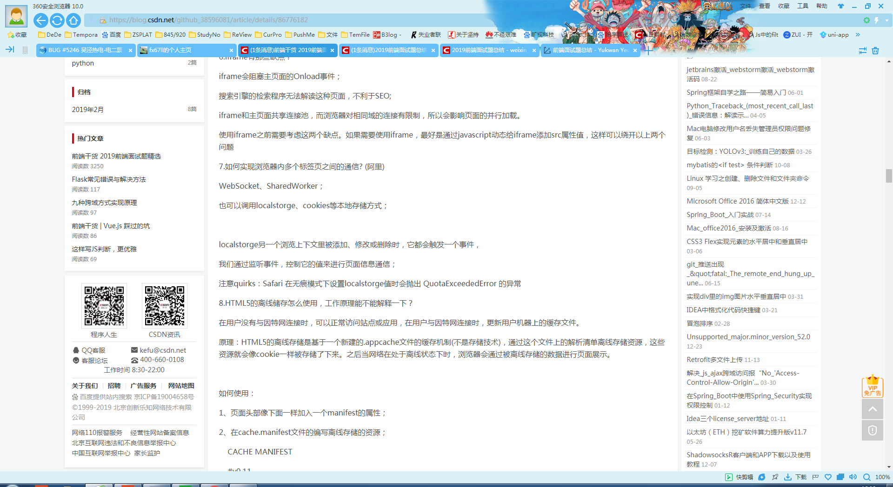

#最后更新于20190424
#前端知识点基础总结

##请描述一下HTML5的新特性
	新的内容标签：header nav content footer article aside
	更好的单元格体系
	音频视频API: video audio 
	画布API: canvas
	地理API
	网页存储API: localStorage sessionStorage
	拖拽释放API
	
##行内元素和块级元素区别？常见的块状元素有哪些？行内元素？常见的空元素有哪些？较真的话还可以看下鲜为人知的元素有哪些？
	CSS规范规定，每个元素都有display属性，确定该元素的类型，每个元素都有默认的display值，
	如div的display默认值为“block”，则为“块级”元素；span默认display属性值为“inline”，是“行内”元素。
	（1）行内元素有：a b span img input select strong（强调的语气）
	（2）块级元素有：div ul ol li dl dt dd h1 h2 h3 h4…p
	（3）常见的空元素：  
  <input> <link> <meta>
	（4）鲜为人知的是：<area> <base> <col> <command> <embed> <keygen> <param> <source> <track> <wbr>

##你对浏览器的内核有了解吗？
	浏览器内核主要分为两部分，渲染引擎和js引擎
	渲染引擎主要用于获取网页的内容（如html、xml、图像等等）、整理讯息（加载css）、以及计算网页的显示方式，然后输出到显示器显示
	浏览器内核的不同对网页的语法解释也会有不同，所以会出现不同的渲染效果
	js引擎则主要用于解析和执行js来实现网页的动态效果
	最开始渲染引擎和js引擎没有很明显的区分，后来js引擎越来越独立，内核更倾向于指渲染引擎

##常见的浏览器内核有哪些？
	Trident内核,Gecko内核,Presto内核,Webkit内核
	1、IE浏览器内核：Trident内核，也是俗称的IE内核； 
	2、Chrome浏览器内核：统称为Chromium内核或Chrome内核，以前是Webkit内核，现在是Blink内核
	3、Firefox浏览器内核：Gecko内核，俗称Firefox内核
	4、Safari浏览器内核：Webkit内核
	5、Opera浏览器内核：最初是自己的Presto内核，后来是Webkit，现在是Blink内核 
	6、360浏览器、猎豹浏览器内核：IE+Chrome双内核
	7、搜狗、遨游、QQ浏览器内核：Trident（兼容模式）+Webkit（高速模式）
	8、百度浏览器、世界之窗内核：IE内核
	9、2345浏览器内核：以前是IE内核，现在也是IE+Chrome双内核

##请描述一下 cookies，sessionStorage 和 localStorage 的区别？
	
	作用：
	cookie是网站为了标示用户身份而储存在用户本地终端（Client Side）上的数据（通常经过加密）,cookie数据始终在同源的http请求中携带（即使不需要），记会在浏览器和服务器间来回传递
	sessionStorage和localStorage不会自动把数据发给服务器，仅在本地保存
	
	存储大小：
    cookie数据大小不能超过4k
    sessionStorage和localStorage 虽然也有存储大小的限制，但比cookie大得多，可以达到5M或更大
	
	有期时间：
    localStorage    存储持久数据，浏览器关闭后数据不丢失除非主动删除数据
    sessionStorage  数据在当前浏览器窗口关闭后自动删除
    cookie          设置的cookie过期时间之前一直有效，即使窗口或浏览器关闭
	
	
##iframe有那些缺点？
	iframe会阻塞主页面的Onload事件，搜索引擎的检索程序无法解读这种页面，不利于SEO，iframe和主页面共享连接池，而浏览器对相同域的连接有限制，所以会影响页面的并行加载
	使用iframe之前需要考虑这两个缺点，如果需要使用iframe，最好是通过javascript动态给iframe添加src属性值，这样可以绕开以上两个问题

##如何实现浏览器内多个标签页之间的通信？
	websoket全双工协议的优势，localstorage但safrai的无痕模式会爆错，不断刷cookie也是可以的，最后一个就是html5的新特性webwork（这四个说法都有待验证）
	
##HTML5的离线储存怎么使用，工作原理能不能解释一下？
	在用户没有与因特网连接时，可以正常访问站点或应用，在用户与因特网连接时，更新用户机器上的缓存文件
	原理是，HTML5的离线存储是基于一个新建的.appcache文件的缓存机制(不是存储技术)，通过这个文件上的解析清单离线存储资源，这些资源就会像cookie一样被存储了下来
	之后当网络在处于离线状态下时，浏览器会通过被离线存储的数据进行页面展示
	如何使用，暂未实践
	
##CSS3有哪些新特性？
	新增各种CSS选择器  （: not(.input)：所有 class 不是“input”的节点）
	圆角          （border-radius:8px）
	多列布局      （multi-column layout）
	阴影和反射    （Shadow\Reflect）
	文字特效      （text-shadow、）
	文字渲染      （Text-decoration）
	线性渐变      （gradient）
	旋转          （transform）
	缩放,定位,倾斜,动画,多背景
	
##CSS选择符有哪些？哪些属性可以继承？优先级是怎样的？
	1.id选择器（ # myid）
	2.类选择器（.myclassname）
	3.标签选择器（div, h1, p）
	4.相邻选择器（h1 + p）
	5.子选择器（ul > li）
	6.后代选择器（li a）
	7.通配符选择器（ * ）
	8.属性选择器（a[rel = "external"]）
	9.伪类选择器（a:hover, li:nth-child）
	
	可继承的样式： font-size font-family color, UL LI DL DD DT
	不可继承的样式：border padding margin width height
	
	优先级就近原则，同权重情况下样式定义最近者为准，同权重: 内联样式表（标签内部）> 嵌入样式表（当前文件中）> 外部样式表（外部文件中）
	important 比 内联优先级高，载入样式以最后载入的定位为准
	
##CSS3新增伪类有那些？
	p:first-of-type 选择属于其父元素的首个 
 元素的每个 
 元素。
	p:last-of-type  选择属于其父元素的最后 
 元素的每个 
 元素。
	p:only-of-type  选择属于其父元素唯一的 
 元素的每个 
 元素。
	p:only-child    选择属于其父元素的唯一子元素的每个 
 元素。
	p:nth-child(2)  选择属于其父元素的第二个子元素的每个 
 元素。
	:after          在元素之前添加内容，也可以用来做清除浮动。
	:before         在元素之后添加内容
	:enabled        页面上可用状态的元素
	:disabled       控制表单控件的禁用状态。
	:checked        单选框或复选框被选中。

##如何让未知宽高的子元素在未知宽高的父元素当中绝对居中？
	
##浮动有什么副作用？请你说一下如何清除浮动？
	还没时间去看一下理解实践一下这个